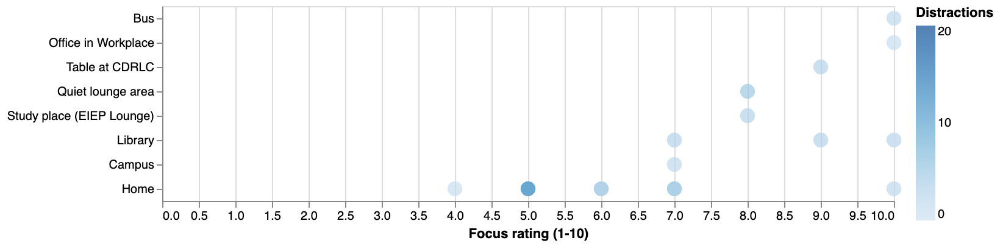
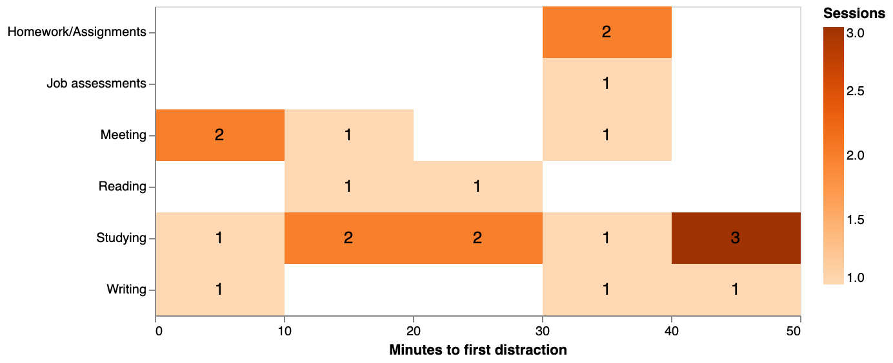
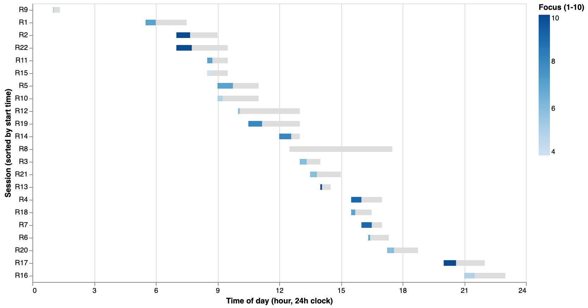
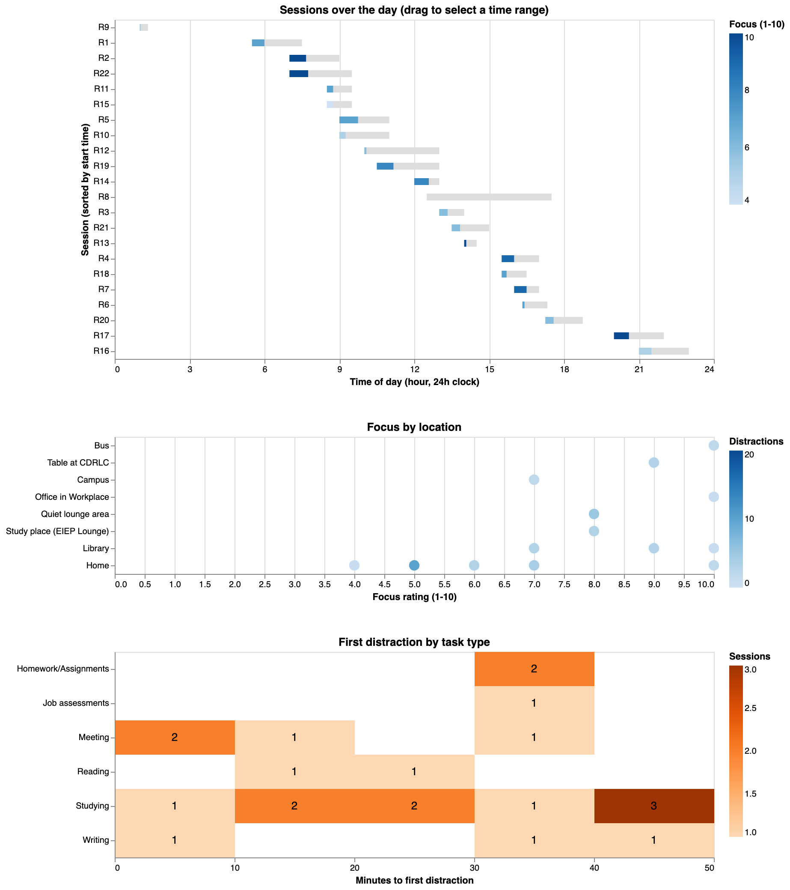
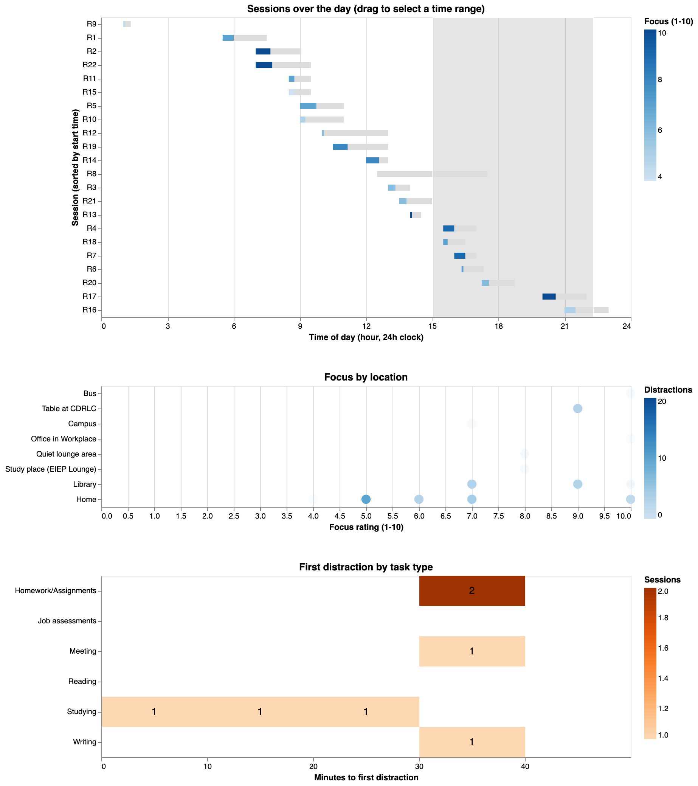
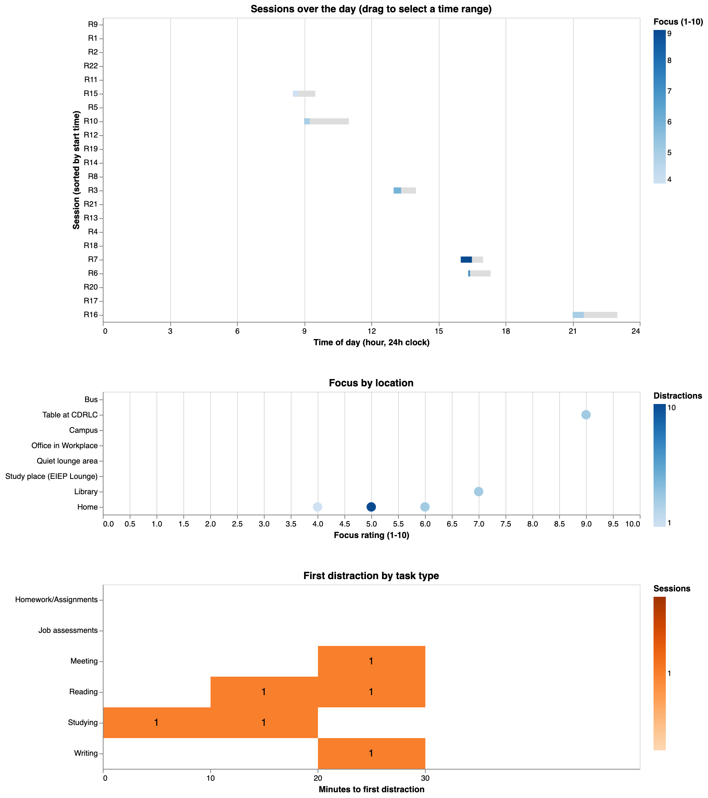

# Assignment 2: Exploring and building visualizations

To run the visualization, see the steps at the top of the [README](README.md).
## Assignment 2: how to run the visualization

The charts are a web page built with Vega-Lite. You only need Python 3 (to run a small local server) and a browser.

1. Open a terminal in this repo's folder.
2. Start a local server:

   ```bash
   python3 -m http.server 8424
   ```

3. Open http://localhost:8424/vis/index.html in your browser.

Opening `index.html` by double-clicking it won't work, because the browser blocks the page from loading the CSV file that way.

What's where:

- `data/raw/form_responses.csv`: the original responses from our Google Form, not edited.
- `vis/index.html` and `vis/charts.js`: the visualization code.
- `vis/screenshots/`: screenshots of the charts at different stages.
- [`Assignment2.md`](Assignment2.md): the Assignment 2 writeup, organized by Tasks 1-7.

## Task 1: Revisit Your Data and Questions

We're keeping the same four questions from Assignment 1, since they still hold up well with the data we have: noise and distractions/focus, task type and time to first distraction, location and focus/distractions, and sleep vs. focus. The one thing we're flagging is that task type is still heavily skewed toward "Studying," so we'll either group it into Studying vs. Non-studying or keep it as is and call out the imbalance when we discuss results.

Looking back at the dataset, we found a few things worth fixing before analysis. The following cleaning and changes will be made:

- Clean the sleep column into one consistent hours format, since it currently mixes hours and minutes in different styles ("7", "420", "7 hours")
- Add an actual session duration column, calculated from start and end time, to compare against planned duration
- Convert distraction count into a rate (distractions per minute) instead of a raw count, so sessions of different lengths can be compared fairly

One real limitation we're keeping as-is: our form only captures the time of the first distraction, not every distraction in a session, so anything involving distraction patterns or clustering is out of scope for this round.

## Task 2: Prepare the data

_To be added._

## Task 3: Explore the data

_To be added._

## Task 4: Implement visualization alternatives

We made three different charts in Vega-Lite (`vis/index.html` and `vis/charts.js`). Each one is for a different question, and we made them look different on purpose so we weren't just making the same chart three times.

### 1. Focus by location (dot plot)



This one comes from our location sketch in Assignment 1. It's for the question of how focus and distractions change depending on where you work. It uses `location`, `focus`, and `distractions`. Every session is a circle. The row shows the location, how far right it is shows the focus rating, and a darker circle means more distractions. We wanted to see every single session instead of an average, because most places only have one or two sessions.

The good part is you can tell right away how uneven our data is. Home and the library have a bunch of sessions and every other place has one. The bad part is that if two sessions at the same place have the same focus rating, the circles sit right on top of each other. Home has 12 sessions but it looks like 5 circles. Our hand sketch didn't have this problem because we drew the circles next to each other. The colors are also off because one person put "20+" distractions, so every other circle looks almost the same light blue. We're keeping this chart but it needs fixing. The circles need to be spread out so you can see all of them, and the colors need to be redone.

### 2. First distraction by task type (heatmap)



This is based on our heatmap sketch, but we put task type on the rows instead of difficulty. It's for the question of whether people get distracted sooner on some kinds of tasks. It uses `task_type` and `first_distraction` (in minutes). Each box is a 10-minute chunk for one task type, and a darker box means more sessions landed there. We also put the number in each box because it was hard to tell the exact count from the color.

We tried this because it shows the whole spread for a task type in one row, and an average can't do that. It works for studying, since there are enough sessions to see they go anywhere from under 10 minutes to over 40. It doesn't really work for the other task types. They only have one to four sessions each, so the rows are mostly empty, and a box with a "1" in it looks like it means more than it does. The one session with no distractions isn't on here at all because it doesn't have a time. We'd keep this for studying sessions, but with this much data it's not great for comparing task types.

### 3. Sessions over the day (timeline)



This one came from our time-of-day timeline sketch. It's for a question we didn't really look at in Assignment 1, which is whether the time of day changes how long someone stays focused. It uses `start_time`, `planned` duration, `first_distraction`, and `focus`. Each session is a bar placed at the time of day it started. The grey bar is how long they planned to work, the blue part is how long until the first distraction, and darker blue means they rated their focus higher.

We tried this because the other two charts don't show time at all. It also lets you compare the first distraction to the planned length for every session at once, and that part worked well. For most sessions the first distraction happens in the first third to half of the planned time. You can also see when people actually work. Most sessions start between 7 AM and 5 PM, and there's nothing between about 1 AM and 5 AM. The problem is that short sessions are tiny when the axis is 24 hours long, so a 20-minute session is almost impossible to see. The session with no distractions is just a grey bar, which could look like the data is missing. We're keeping this one and we think it's the best of the three, but we need to change the scale so the short sessions are easier to read.

## Task 5: Interaction and multiple views

After Task 4 we had three separate charts that each showed one thing. The problem was that our questions connect to each other. If you notice something on the timeline, like the late sessions, you want to know where those sessions happened and how focused people were, and with three separate charts you'd have to match up session numbers by hand. So we put all three charts on one page and linked them. We only added two interactions, and each one is there for a reason.



**Selecting a time range (linked views).** You can drag across the timeline to pick a part of the day. The location chart fades out every session that isn't in that range, and the heatmap recounts using only the sessions you picked. This lets someone ask things like "what do evening sessions look like?" and see the answer in all three charts at once. In the screenshot below we selected about 3 PM to 10 PM. The location chart shows those sessions were mostly at home and the library, and the heatmap shows only the first distractions from those sessions. Double-clicking the timeline clears the selection.



We made the location chart fade instead of hiding the other sessions because you still want to see the selected ones compared to everything else. The heatmap is different. It shows counts, so fading doesn't make sense there, and it just recounts.

In Task 4 we said the heatmap wasn't great on its own because most task types only have a few sessions. We kept it on the page anyway because it's more useful once it's linked. Instead of trying to compare every task type at once, you can pick a time range or a noise level and see when the first distraction happened for just those sessions.

**Filtering by noise level.** There's a dropdown under the charts for Very Quiet, Quiet, or Moderate, and picking one filters all three charts to those sessions. We added this because noise was one of our original questions and none of the three charts shows noise on its own. This way we didn't need a fourth chart for it. Below is what it looks like with Moderate selected.



**Hovering.** Every chart also shows the details of a session when you hover over it, like the task, start time, and focus rating. We kept this because the charts only use a few columns each, and sometimes you want to check the rest without leaving the chart.

**What we decided not to add.** We thought about a dropdown to change what the colors mean (focus, distractions, or effectiveness), but we couldn't think of a question it would help answer, so we left it out. We also didn't add zooming, because there are only 22 sessions and everything already fits on the screen.

**A problem we ran into.** The first time we added the noise filter, the rows in each chart disappeared when they had no sessions, so the charts kept changing size and the title of the top chart got cut off. We fixed it by keeping every session, location, and task type on the axes all the time, even when they're empty. It also turned out better this way, because now you can see which places and tasks have nothing at that noise level instead of them just vanishing.

One thing we're still not sure about is whether people will figure out that they can drag on the timeline. Right now there's just a line of text at the top telling them. That's something we want to check in Assignment 3.

## Task 6: Iterate and refine

_To be added._

## Task 7: Current design

_To be added._
