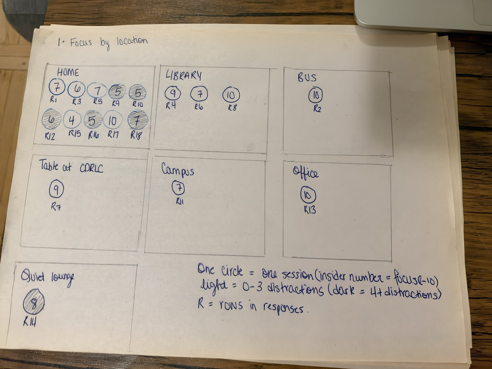
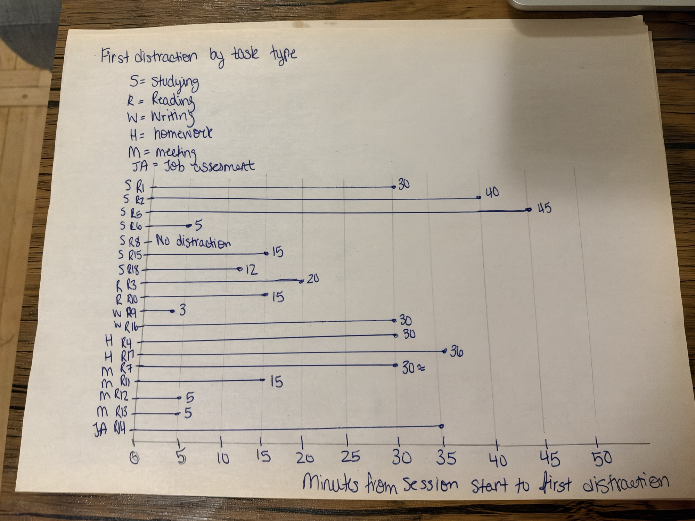
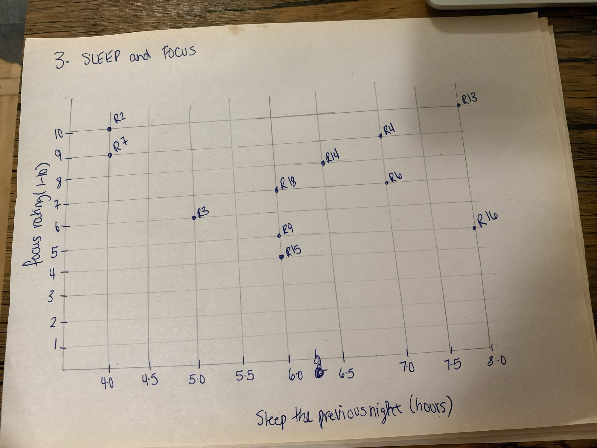

# FocusTrace
FocusTrace is a self-observed dataset built around everyday focus sessions — studying, working, reading, or any sustained-attention task. Participants record when the first distraction hits, how many distractions follow, and how that compares across task type, environment, sleep the night before, phone use earlier in the day, caffeine intake, and any focus strategy used during the session. Pairing a measurable attention proxy (time to first distraction) with these everyday factors lets us explore whether certain environments, strategies, or habits correlate with longer sustained focus.

## Task 1: Observation and data collection plan

1)	What configures one observation
One observation will consist of one completed study/work session recorded by one group member. Each row in our dataset will represent one session, including the task, duration focus, distractions, location and other factors for that session.

2)	What attributes will you record for each observation?
For each study/work session, we will record the date, start and end time of the, task type, task interest, task difficulty, self- rate focus, planned duration , time to first distraction, number of distractions, location, Environment- noise level, number of people, interaction level, sleep duration from previous night, phone screen time before the session, caffeine consumed before the session, and focus strategies used. 

3)	Where and when will you record each observation
We will collect the data using a Google Form. That form then will be distributed to participants outside of our group. Participants will complete the form after their study/work sessions and report information about the session, including the time, task, focus, distractions, locations and environmental conditions. Participants can complete the form wherever they normally study or work, such as their home, library, classroom or café. We plan to collect data through Friday 09/25/2026. 

4)	How many locations, times, or days will you collect it?
We plan to collect observations from multiple participants over several days, from September 22 through September 25, 2026. Since participants have different schedules and study habits, observations will be collected at different times a day and in different locations. Participants will be encouraged to record multiple study/work sessions, which will give us observations across different tasks, locations and environmental conditions. 

5)	How will ensure that your data captures meaningful variation rather than a single snapshot?
We will collect data from multiple participants and encourage each participants to record multiple sessions over several days. Because participants will study or work at their normal locations and times, we expect variations in task type, task interest, task difficulty, location, noise level, number of people present, interaction, sleep, phone screen time, caffeine intake and focus strategies. We will monitor the responses while collecting the data to determine whether there is enough variation to support meaningful comparisons. If we find that an attribute has little variation or does produce useful data, we may revise our collection strategy or remove or modify that attribute.
6)	How will you decide on what to observe?
We will focus on regular study and work sessions performed by the participants. A single observation will be one completed study/work session. Participants will record sessions involving activities such as studying, coding, reading, writing, or completing assignments. We chose these observations because they allow us to examine task characteristics, environmental conditions and other factors.

7)	How will the collection be divided among members?
Our group members will work together to design and distribute the Google Form, defining the attributes. The actual data observations will be collected from participants outside out group. Each member will help distribute Google From and recruit participants. We will work together to monitor the responses and check the collected data for missing or inconsistent values. We will communicate with each other if we need to clarify or need help on something.

8)	What might your collection process fail to capture?
Our collection may fail to capture minor distractions because participants might forget to record them. They might also intercept terms such as “distractions” and “noise level”, or “interactions” differently. Self-reported measures such as task interest, difficulty, and self-rate focus, sleep, may also be inaccurate since participants are estimating their own experiences. Additionally, participants may not record every study/work session, so the collected observations may not represent all their sessions. 

9)	How might your collection process introduce bias?
Our collection may introduce because participants may have different study habits, schedules, academic activities and preferred locations, which could affect the types of observations included in our dataset. There might be bias because participants are also recording their own focus, distractions, sleep, screen time and other information. 

| Attribute |	Type | Description |	Example |
| :---| :--- | :--- | :--- |
| Date	| Temporal | Date of the study/work session | 09/22/2026 |
| What time did the session start? (start_t) | Temporal |Time of the session started | 9:00 am |
| What time did the session end? (end_time) |Temporal | Time of the session ended | 11:00 am |
| What type of task were you doing? (task_type)| Categorial | Type of task performed | Reading|
| How interesting was the task? (task_interest)| Quantitative | How interesting was the task, rated 1-10|	7|
| How difficult was the task?(task_difficulty)| Quantitative | How difficult was the task, rated 1-10|	8|
| How long did you plan to work/study (planned_duration) | Quantitative| Number of minutes planned for the session | 120 |
| How many minutes until your first distraction? (time_ to_ first_distraction) | Quantitative | Minutes from session until first distraction |	30 |
| How many distractions occurred? (number_ of_ distractions) | Quantitative  |Total number of distractions during the session | 5 |
| How focused were you during the session?(self-rate_focus)|Quantitative|Overall focus during the session, rated 1-10|6|
| Where did you study/work?(location)|Categorial|Location where the session occurred|	Library
| How would you describe the noise level during this session?(noise_level)|Categorial|Perceived noise level during the session|Very Noisy|
| How many other people were around you during this session?(people_present)|Categorial|Number of other people present|	3-5 people|
| How much interaction did you have with others? (interaction_level) | Categorial | Amount of interaction with other people | None |
| How many hours did you sleep the previous night? (sleep_hour) | Quantitative | Hours of sleep the previous night | 7.5 |
| How much phone screen time you had accumulated that day? (phone_screen_time)| Quantitative | Phone screen time accumulated before the session | 145 min |
| What caffeine did you consume before the session? (caffeine) | Categorical | Caffeine consumed before the session | Tea |
| Which focus strategies did you use? (focus_strategies) | Categorial (multi-select) | Focus strategies used during the session | Timer, Headphone |

## Task 2: Pilot and data collection

  
We conducted a pilot collection of approximately 10 observations before continuing data collection the full set. The pilot showed that the general structure of the form was workable, but several attributes were not being recorded consistently. Participants entered planned duration, sleep, phone screen time and time to first distraction using different units and formats. Example planned duration was entered as both numbers and text such as “90min” and “3 hours”. We also found inconsistent task labels, such as “Meeting” and “Meetings”. One date was entered incorrectly, and some sessions had unusual start and end time that indicated that the form needed clearer instructions for sessions crossing midnight.

Changes to be made:
Based on this observation, we revised the collection procedure and data dictionary. We clarified that planned duration, time to first distraction, and phone screen time should be recorded in minutes, while sleep should be recorded in hours. We standardized the task categories and clarified the definitions of environmental variables. We also added clearer instructions for situations such as having no distractions and not knowing the exact amount of sleep or screen time. These changes should make the remaining observations more consistent and easier to analyze. 

The form: Questions to modify
How long did you plan to work/study? Enter the number of minutes. Example: 120
How many minutes after starting the session did you experience your first distraction? Enter a whole number? If no distraction occurred enter 0: 
How many hours did you sleep the previous night? Example: 7.5
How many minutes of phone screen time had you accumulated before this session? Example: 145

How much did you interact with other people during the session?
•	None – no interaction
•	Very little – brief interaction, such as saying hello or asking a quick question
•	Some – several conversations/ interactions
•	A lot – frequent or prolonged interaction

## Project Feedback & Responses
* [Fill out the Feedback For](https://forms.gle/xCBtWwGwoUR8A6Lw8)
* [View Public Response Sheet](https://docs.google.com/spreadsheets/d/1n-ynM2vjrijfOLAFeJ0SqMOiUnv9c6To3Dx9ByDkdFU/edit?usp=sharing)

## Task 3: Data description and domain questions

Our data comes from study and work sessions that people logged in our Google Form after they finished. One row is one session. For each session we have the start and end time, what kind of task it was, how long they planned to work, how many minutes until they first got distracted, how many distractions they had, a focus rating (1–10), where they were, how noisy it was, how many people were around, how much they slept, their phone screen time, caffeine, focus strategies, and how effective the session felt overall (1–5).

We added the effectiveness question after the pilot because we realized focus and "did this session actually go well" aren't the same thing. Looking at the responses, most sessions were studying, at home, and quiet. People rated their focus pretty high, and no one went below 4. Effectiveness was more spread out (2 to 5) and usually went up with focus, but not always. One person said their session was extremely effective even though they rated their focus a 5 and had 10 distractions. Sessions happened all through the day, from early morning to late at night. The coverage isn't even, though. Other than home and the library, most places only show up once. Nobody picked anything louder than Moderate for noise, so we don't have any noisy sessions to compare with. The sample is also small, the people who filled out the form might not be like the people who didn't, and everyone was guessing their own focus and distractions. Some answers were messy. Sleep and planned time had hours and minutes mixed together, one date had the wrong year, two sessions mixed up AM and PM, someone wrote "20+" for distractions, and a few sleep and screen time answers were left blank. A 0 for time to first distraction means they didn't get distracted at all (the updated form says this now), so we treat those sessions separately instead of reading them as getting distracted right away.

Making each session one row let us see when and where someone worked and compare their focus with their surroundings and habits. But a row can't show what actually distracted them, how long it lasted, or how their focus changed during the session. Noise is also just how loud it felt to them, not something we measured. We used simple categories and numbers so sessions would be easy to compare, but that makes something complicated look simpler than it is. So we're looking for patterns, not saying one thing caused better focus.

After looking at the responses, these are the four questions we want to explore. We chose them because the data actually has these attributes and enough variety in them, not because we already know the answers.

1. **Do quieter sessions have fewer distractions and higher focus?** This looks at noise level, number of distractions, and focus rating, to see if the surroundings matter. We can only compare the three noise levels people actually chose.
2. **Does the time before the first distraction change depending on the task?** This uses task type and minutes to first distraction, since studying, reading, writing, and meetings probably need different kinds of attention. Sessions with no distractions get left out of this comparison.
3. **How do focus and distractions change by location?** This uses location, focus rating, and number of distractions. Since most places only show up once, we compare home, the library, and everything else grouped together.
4. **Is there a pattern between sleep and focus?** This uses hours of sleep the night before and focus rating, after converting all the sleep answers to hours and leaving out the blank ones.

Our first plan had more things we wanted to look at, like phone use, interaction with others, caffeine, and focus strategies. Seeing the actual responses changed that. Most people said no caffeine and no focus strategy, so there wasn't really anything to compare. Phone screen time had the same unit problems as sleep, and some answers were missing. Noise, task type, location, and sleep had more variety, so our questions shifted toward those. The pilot also showed us people wrote answers in different units and labels, so our questions now take missing or unclear answers into account.

## Task 4: Task abstractions

1. **Noise and focus.** The action here is to compare. The targets are the distributions of distraction counts and focus ratings for each noise level. We want to see if quieter sessions usually have fewer distractions or higher focus. Looking at the whole distribution instead of just an average matters because we also need to see how many sessions are in each group. A pattern from only one or two sessions wouldn't mean much.

2. **Task type and first distraction.** The action is to compare again, and the target is the distribution of time to first distraction for each task type. This shows whether some tasks get interrupted sooner, and whether sessions of the same type look similar. There's also a smaller task, which is identifying the sessions with no distraction. They're outliers because of what the 0 means, not because of the number itself. A 0 doesn't mean they got distracted right away, so they need to be pulled out before comparing.

3. **Location and focus.** The main action is to compare the distributions of focus ratings and distraction counts across places. We also need to look up how many sessions each place has, so we can spot places with too few sessions to trust. We want to know if focus and distractions seem different at home, at the library, or somewhere else, but one response from a bus or an office doesn't really tell us much about that place.

4. **Sleep and focus.** The action is to identify the correlation between sleep the night before and focus during the session. We also want to find outliers, like someone who barely slept but still focused well, or the other way around. The targets are each session's sleep hours and focus rating, because you can only see the relationship when you look at both values together for each session. Before that, we need to put all the sleep answers in hours and leave out the missing ones.

Writing these out changed how we think about our questions. At first they were pretty broad, just "what affects focus." Breaking them into actions and targets showed us that three of them are really about comparing distributions across categories, and only the sleep question is about how two numbers relate. That difference will affect how we sketch them. It also showed us that checking group sizes, missing answers, and what a 0 means are actual tasks, not just side notes. These abstractions are about what someone needs to learn from the data. How to draw them is something we'll figure out in the sketches.

## Task 5: Visualization sketches

1. **The Estimation Gap —** Planned Duration vs. Time to First Distraction

This sketch shows planned session duration against time to first distraction for five sessions, using a dumbbell design: a black dot for planned time, a colored dot for time to first distraction, and the connecting line's length showing the gap between them, colored by effectiveness rating (1–3 vs. 4–5).  We initially plotted planned vs. actual session length, but realized actual duration didn't clearly connect to attention. A session could end early for reasons unrelated to focus. We switched to time to first distraction instead, since it ties the gap directly to when attention breaks down, giving a more meaningful read on whether bigger gaps relate to lower effectiveness.

2. **Distraction Timing by Environment —** Early vs. Middle, Across Noise and Social Context

This sketch shows, for four environment categories, what share of sessions had their first distraction occur early versus in the middle of the planned session. We originally planned to include "late" and "clustered" distraction patterns, but realized our form only captures a single first-distraction timestamp per session, not a full sequence so clustering isn't measurable. The stacked bars use color and proportion to compare timing patterns across quiet/noisy and alone/others conditions, revealing an unexpected pattern where quiet, solitary sessions had more early distractions than quiet sessions with others present.

3. **The Difficulty Heatmap —** First Distraction Timing by Task Difficulty

This sketch shows, for three difficulty levels (Low 1–3, Medium 4–8, High 9–10), how many sessions had their first distraction occur within each 10-minute window of the session, using a matrix layout: difficulty as rows, time bins as columns, and cell color intensity (marks: cells; channel: color/saturation) encoding the count of sessions. We initially tried a parallel-coordinates sketch linking five attributes at once (sleep, screen time, difficulty, time to distraction, focus), but it got cluttered and hard to read once more sessions were added. We also initially planned to encode total distraction counts across the session, but realized the form only records the time of the first distraction, not every distraction event so we switched to counting sessions by first-distraction timing instead, which still lets us see whether harder tasks tend to lose focus earlier than easier ones.

### Sketch 1: Focus by Location

I made this sketch to compare focus and distractions across different study or work locations. Each circle represents one session, the number inside shows its focus rating, and the shading shows its distraction group. Light circles mean 0–3 distractions, while dark circles mean 4 or more. Grouping the circles by location makes the sessions easy to compare. However, home has many more responses than the other places, so the comparison is uneven. This design focuses on location, while my other sketches focus on task type and sleep.

### Sketch 2: First Distraction by Task Type

I made this sketch to explore whether the first distraction happens earlier during some types of tasks. Each horizontal line represents one session, and an X marks the time of its first distraction. The position of the X shows the number of minutes, while the rows group sessions by task type. This makes the differences between sessions easy to see, but the many lines can make the sketch crowded. The response saying “around 30” is approximate. The session with no distractions is labeled separately because its recorded zero does not mean an immediate distraction.

### Sketch 3: Sleep and Focus

I made this sketch to look for a possible relationship between sleep the previous night and focus during a session. Each dot represents one session. Its horizontal position shows sleep in hours, and its vertical position shows the focus rating from 1 to 10. This design helps show patterns and unusual sessions, although it cannot prove that sleep caused a change in focus. I used 11 responses with usable sleep values and left out seven missing or unclear entries. Unlike the other two sketches, this one compares two number-based attributes.

## Task 6: Summarizing
## Task 7: Collaboration process

We worked as a team of three, communicating through a mix of quick in-person check-ins after class and ongoing online chats for day-to-day updates. Mariam created the Google Form, and all three of us shared it with our own friends and family to maximize responses, encouraging participants to log as many sessions as possible to build up a reasonably sized dataset.

A lot of the consistency came from working on the form together before collection even started, rather than each of us collecting separately and trying to fix mismatches later. We went back and forth on the attributes quite a bit. Some got reworded, a few got added once we realized we were missing something we actually cared about. Once the form felt solid, we sat down and talked through what questions we actually wanted the data to answer, which fed straight into Task 5. For the sketches, each of us came up with our own ideas first and shared them in the group chat, then went through them together and pushed back on each other's choices where something wasn't working. For the writeups, we just split the remaining tasks evenly, two each.

What worked well was that everyone stayed accountable and responsive to their part, and feedback was communicated openly and taken in good spirit rather than defensively, which made it easy to revise ideas quickly.

Because we iterated on the dataset's attributes together before collection began, we caught gaps and redundant fields early, which meant less rework later when a cleaner, more consistent set of fields fed directly into our questions and sketches. On the visualization side, having each member sketch independently before reviewing as a group gave us a wider range of genuinely different ideas than any one of us would have produced alone. Several of our refinements came directly from one person noticing a limitation in another's sketch during review, rather than from reworking our own ideas in isolation.

